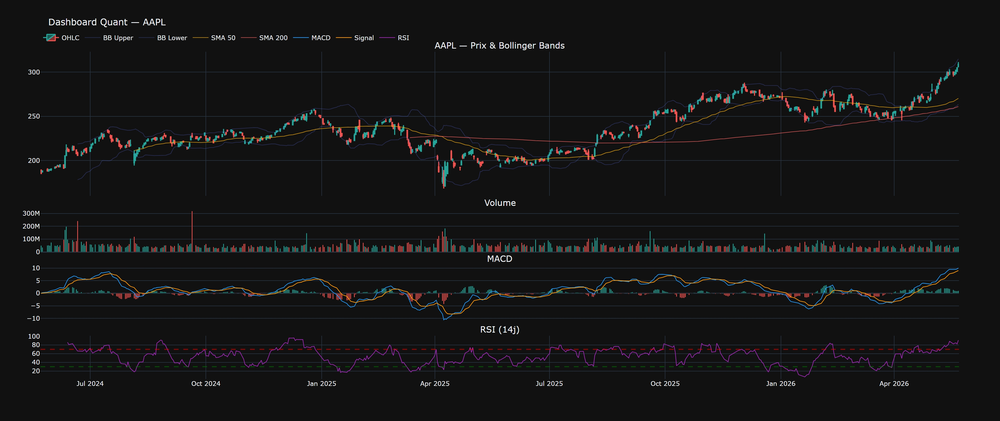
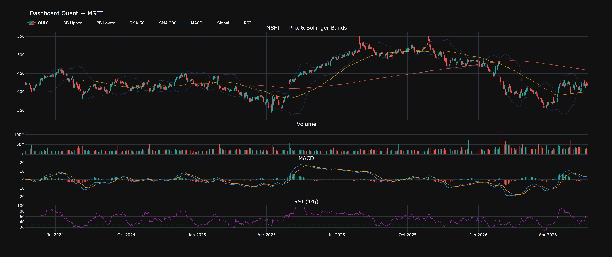
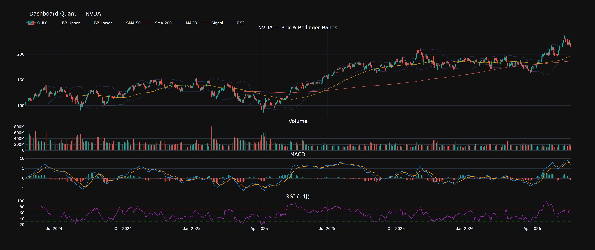

# Stock Price Scraper & Analyser

**Du ticker au tableau de bord — en une commande.**

Petit laboratoire Python pour récupérer des cours boursiers, les nettoyer, calculer des indicateurs techniques et sortir des métriques de performance lisibles. Pensé pour explorer le marché comme un analyste quant : données propres, signaux visibles, chiffres qui parlent.

Par défaut, le script suit **Apple**, **Microsoft** et **NVIDIA** sur **2 ans** de historique.

---

## Aperçu des dashboards

Chaque titre génère un dashboard interactif (chandeliers, volume, MACD, RSI). Voici les captures exportées :

| Apple (AAPL) | Microsoft (MSFT) | NVIDIA (NVDA) |
|:---:|:---:|:---:|
|  |  |  |

*Thème sombre Plotly — bandes de Bollinger, SMA 50/200, volume coloré selon le sens du jour.*

---

## Ce que fait le script

```
Yahoo Finance  →  Nettoyage  →  Indicateurs  →  Métriques  →  CSV + HTML
```

1. **Téléchargement** — historique OHLCV via [yfinance](https://github.com/ranaroussi/yfinance)
2. **Nettoyage** — doublons retirés, trous comblés, lignes incohérentes filtrées
3. **Indicateurs** — rendements, volatilité annualisée, SMA/EMA, MACD, RSI, Bollinger, drawdown
4. **Performance** — rendement total et annualisé, Sharpe, Sortino, max drawdown, VaR & CVaR à 95 %
5. **Visualisation** — dashboard Plotly sauvegardé en HTML (ouvrable dans le navigateur)

---

## Démarrage rapide

### Prérequis

- Python 3.10+
- Connexion internet (données Yahoo Finance)

### Installation

```bash
pip install yfinance pandas numpy matplotlib plotly
```

### Lancement

```bash
python app.py
```

Le script affiche la progression dans le terminal, puis produit les fichiers de sortie à la racine du projet.

### Personnaliser les titres ou la période

Dans `app.py`, section `if __name__ == "__main__"` :

```python
TICKERS = ["AAPL", "MSFT", "NVDA"]  # vos symboles Yahoo
PERIOD  = "2y"                       # "1y", "5y", "max", etc.
```

---

## Fichiers générés

| Fichier | Description |
|---------|-------------|
| `{TICKER}_data.csv` | Données enrichies (OHLCV + tous les indicateurs) |
| `{TICKER}_dashboard.html` | Dashboard interactif Plotly |
| Terminal | Récapitulatif comparatif des métriques pour tous les tickers |

Exemple après exécution : `AAPL_data.csv`, `AAPL_dashboard.html`, et idem pour MSFT et NVDA.

---

## Indicateurs & métriques

**Techniques**

- Rendements (log et simple)
- Volatilité rolling 20j / 60j (annualisée, base 252 séances)
- Moyennes mobiles : SMA 20, 50, 200 — EMA 12, 26
- MACD (ligne, signal, histogramme)
- RSI 14
- Bandes de Bollinger (20j, ±2σ)
- Drawdown

**Performance**

- Rendement total et annualisé
- Volatilité annualisée
- Ratio de Sharpe et de Sortino
- Max drawdown
- VaR et CVaR historiques à 95 % (horizon 1 jour)

---

## Structure du projet

```
StockPriceScraperAnalyser/
├── app.py                 # Script principal
├── images/
│   ├── AAPL.jpeg          # Capture dashboard Apple
│   ├── MSFT.jpeg          # Capture dashboard Microsoft
│   └── NVDA.jpeg          # Capture dashboard NVIDIA
├── README.md
└── (générés à l'exécution)
    ├── *_data.csv
    └── *_dashboard.html
```

---

## Stack

| Outil | Rôle |
|-------|------|
| **yfinance** | Source de données marché |
| **pandas** / **numpy** | Manipulation et calculs |
| **plotly** | Graphiques interactifs |
| **matplotlib** | Importé pour extensions futures |

---

## Notes

- Les données proviennent de **Yahoo Finance** : qualité et disponibilité dépendent du fournisseur ; ce projet est un outil d’**analyse et d’apprentissage**, pas une plateforme de trading.
- Les métriques (Sharpe, VaR, etc.) supposent des rendements historiques : **elles ne prédisent pas l’avenir**.
- Les dashboards HTML s’ouvrent dans le navigateur via `fig.show()` à la fin de chaque traitement.

---

## Licence & usage

Projet personnel — libre d’utilisation, de modification et de partage pour l’apprentissage et la démo. Pour un usage professionnel ou réglementé, validez vos sources de données et votre cadre juridique.

---

*Construit pour apprendre la finance quantitative en pratique : moins de slides, plus de courbes.*
